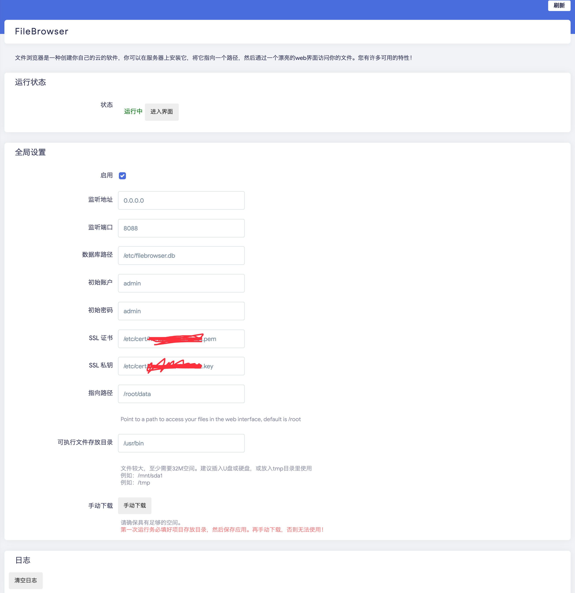

# luci-app-filebrowser
在Lienol的源码基础上改进而来，添加了更多特性和配置项。

在OpenWRT中配置filebrowser的LUCI应用

此分支适用于OpenWRT 19.*，需要提前安装`luci-compat`包

18.06请使用18.06分支

由于可执行文件很大，至少32MB，因此ipk中不集成filebrowser的可执行文件。

首次运行前，需要手动下载可执行文件，如果你的空间足够大，推荐可执行文件目录配置为`/usr/bin`，否则根据需要放到你认为合适的目录。（路径不能包含空格）




# 构建

Release页有编译好的ipk包，可直接安装，或者可以手动编译

```
git clone https://github.com/xiaozhuai/luci-app-filebrowser package/luci-app-filebrowser
make package/luci-app-filebrowser/compile
```


